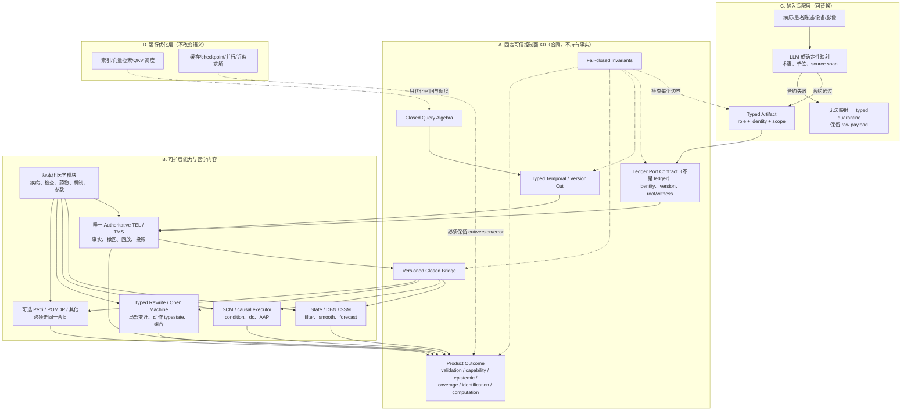
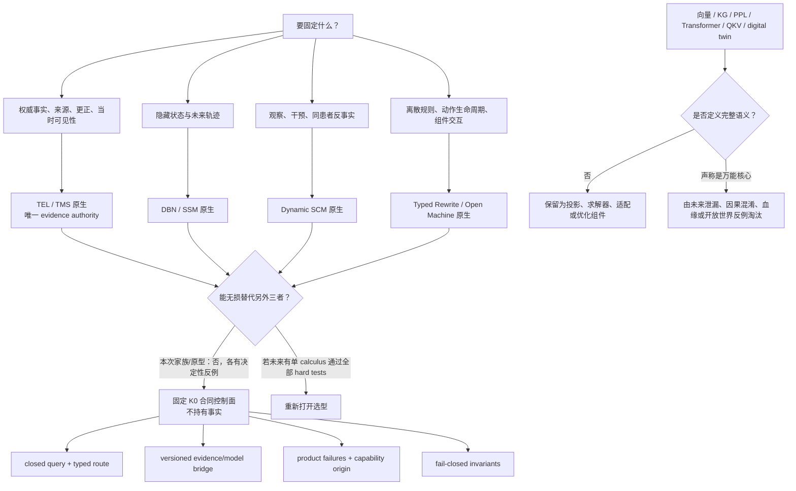

# K0 动态临床计算架构

> 这是 `K0-v0.1` 的可读架构说明。形式定义以 `FORMAL_SPEC.md` 为准；选择理由和证据边界见 `DECISION.md`。当前 Python 代码只实现 **`K0-executable-subset-v0.1`**，不是完整规范实现；冻结的 isolated panel-v3 也保留了 hard FAIL，不能表述为“架构已经全通过”。

## 1. 先用一句话说明

系统不把患者压成一个永远正确的向量、图或“当前状态”。它先保存**实际收到且有来源的事实历史**，再针对明确问题，在明确时间切片和模型版本下调用合适的数学子内核，最后把答案、适用边界、失败状态和证据血缘一起返回。

关键规则是：

```text
原始事实 ≠ 模型推断 ≠ 患者真实隐藏状态 ≠ 计划动作 ≠ 已执行动作
```

它们可以相互关联，但不能互相冒充。

## 2. 一页架构内核图



图中的 A 才是固定核心；它固定 ledger port、身份、cut、query/result 和不变量，**不另存一份事实**。B 中的 TEL/TMS 是完整参考联邦唯一的 evidence authority；其他子内核只消费它给出的冻结 cut/witness，模型输出也只能成为带 provenance 的派生产物。B 中的疾病和模型可持续扩展；C 中可使用 LLM，但 LLM 输出必须变成可审查 artifact；D 中可使用 QKV、向量检索和缓存，但它们不能决定事实是否存在或绕过安全规则。

## 3. 固定核心的七个部分

### 3.1 TypedArtifactRole

每个进入系统的对象先声明认识论角色，例如：

- `raw_observation`：设备或人工观察；
- `subject_statement`：患者/家属陈述；
- `deterministic_derivation`：可重复计算结果；
- `inference` / `hypothesis`：模型输出或诊断假说；
- `plan` / `order`：尚未发生的动作；
- `performed_intervention` / `stopped_intervention`：有执行回执的动作。

角色不是显示标签，而是合法操作的类型门。`plan` 不能进入生理 effect channel；模型输出不能重新摄取为 `raw_observation`。

### 3.2 IdentityAndScope

系统分开保存：

- proposition/concept identity；
- artifact/version identity；
- evidence-root occurrence identity；
- subject、encounter、specimen、device、site、body-site scope；
- 可重叠的 source/dependency families。

“同一个命题”不代表“同一次测量”。三次对同一温度记录的转述仍只有一个 root；三台独立设备的三次测量可以有三个 root。系统不把 root 数自动解释为统计独立，独立性属于具体模型假设。

### 3.3 TypedTimeAndCut

至少区分：

- `effective/occurrence`：现实中何时成立；
- `collected`：何时采样；
- `available`：某行为者何时有资格知道；
- `recorded/transaction`：何时进入系统版本；
- `expires/invalidation`：何时不再代表当前状态；
- `performed action interval`：动作实际开始和停止。

一次查询携带完整 cut：目标时间窗、知识可见上限、事务/修订上限、evidence snapshot、knowledge/model/policy version、外部响应快照和 randomness policy。事务顺序只服务回放，不能制造临床因果。

历史问题必须分开：

1. `replay_as_then`：旧证据前缀 + 当时模型；
2. `reinterpret_now`：旧证据前缀 + 当前模型；
3. `smooth/reconstruct`：明确允许后来证据估计过去状态。

第三种不能冒充第一种。

### 3.4 VersionedDerivationAndProvenance

K0 规定 proof/witness 的类型和守恒不变量；唯一 TEL/TMS evidence authority 保存其权威实例。最小 proof 结构为：

```text
Proof = Root(root_version)
      | Apply(transform_version, premises, assumptions)
      | ModelRun(model_version, solver_version, premises, assumptions, native_artifact)
```

`roots(proof)` 只做 root occurrence 的集合并集，因此复制、转述和确定性多路径不会凭路径数增加独立证据。完整 proof 仍保留替代推导和规则结构，不能只保存扁平 root set。

撤回是“某个版本的 root 不再有资格”，不是临床阴性。正确性判据是：

```text
incremental retract 的结果 == 删除该 root 后 clean rebuild 的结果
```

### 3.5 ClosedQueryAlgebra

查询使用封闭 sum type，而不是自由字符串或回调：

```text
EvidenceView / Project
ReplayAsThen / ReinterpretNow
Filter / Smooth / Forecast
Condition / Intervene / Counterfactual
EvaluatePolicy
Reachability / CheckInvariant
Explain
```

重要的不等式：

```text
filter != smooth
condition != do != same-patient counterfactual
forecast != counterfactual
querying an action != performing an action
```

不支持某个查询时返回 typed `unsupported`，不能偷换成最接近的运算。

### 3.6 ProductResultAndFailure

单一 `status=ok` 不足。结果至少同时保留：

| 轴 | 典型值 |
|---|---|
| validation | valid / invalid |
| capability | native / companion / unsupported |
| epistemic | supported / refuted / unknown / conflicting / not-applicable |
| coverage | in-domain / partial / out-of-model / unknown |
| identification | identified / partially-identified / not-identified / not-applicable |
| computation | exact / approximate / nonconverged / no-solution / multiple-solutions |

例如 `conflicting + out_of_model + not_identified + solver_ok` 可以同时成立。任何 bridge 或上层 UI 都不得把这些 taint 洗成一个绿色 `OK`。

### 3.7 InvariantEnforcement

不可被检索、模型或插件绕过的核心不变量包括：

- 未知、未询问、未检查和未召回不等于阴性；
- cut 外的未来输入不改变 cut 内结果；
- 推断不能成为自己的外部证据；
- 复制/转述不增加 evidence roots；
- subject/specimen/unit/time-role 不兼容先失败；
- 计划或医嘱不产生已执行 effect；
- state-transition effect 与 observation-channel effect 分离；
- 未声明的共病/组件交互返回局部 unsupported，不默认相加；
- 多解、无解、不收敛和数值近似必须显式；
- task projection 只生成视图，不修改事实层。

## 4. 子内核为什么必须分家

### 4.1 Evidence/TEL

它是完整参考联邦**唯一的 evidence authority**，权威回答：某个时点有资格看到哪些事实？某结论来自哪些 roots/规则版本？删除来源后哪些结论失效？K0 只规定它必须遵守的 ledger port、identity、cut 和 witness 合同，不与它并列保存另一份病历。

它不回答：患者隐藏炎症强度是多少？某治疗是否因果有效？

### 4.2 State/Dynamics

用 DBN/SSM/ODE/SDE 等原生语义回答：给定 observation/action model 和证据，隐藏状态 posterior、过滤、平滑或未来轨迹是什么？

它的 belief 不是权威病历；checkpoint 也不能替代证据版本历史。

### 4.3 Causal

用 SCM/causal executor 区分观察条件、机制替换和同一患者替代历史。AAP 流程是 abduction → action → prediction；其外生背景共享策略必须显式。

causal parents 不是文档 provenance。因果图正确与否也不能从拟合优度自动证明。

### 4.4 Rewrite/Open Machine

用 typed terms、局部规则、action typestate、ports/wiring 和声明式组合律表达离散变化、规则推导、可达性、安全和局部扩展。

类型正确只证明连接合法，不证明医学交互方程正确；未声明交互仍应拒绝。

### 4.5 完整 profile 和降级

当前完整参考 profile 要求四组能力齐备：TEL/TMS evidence authority、state/dynamics、causal、typed rewrite/open safety。它们可以部署在同一进程，但每项 query 的能力来源和 native witness 必须分别可见。

- 缺 TEL/TMS evidence authority：只可做离线合同验证，不构成临床事实运行时；
- 缺 state/dynamics：病历投影与重放仍可用，`filter/smooth/forecast` 返回 typed `unsupported`；
- 缺 causal：conditioning/预测不自动获得 `do` 或同患者反事实能力；
- 缺 rewrite/open：不得自动施加 action effect，也不能声称 reachability、组合或相应 safety invariant 已检查。

降级不是错误，只要 scope 明确、结果携带 capability boundary，且不由语义不同的子内核静默代答。

## 5. 版本化 bridge

只有 bridge 可以把一个 evidence cut 物化成模型输入。参考实现的 `EvidenceModelBridge` 是不可变、版本化、封闭数据：

```text
bridge_id + version + registered_at
source_concept/role/unit
target_concept/role/unit
closed transform enum
```

它没有 callback、SQL、prompt 或任意 bytecode 字段。identity bridge 不允许静默换单位；观察/计划 bridge 不能制造 performed action。一次 bridged query：

1. 在 ledger 上执行 evidence query；
2. 验证 subject、cut、role、unit、information state 和唯一性；
3. 记录源 proof/root/version；
4. 生成临时、带 lineage 的模型输入；
5. 在 fresh model run 中执行原生 query；
6. 把 evidence witness、bridge version、model/solver version 和 capability origin 合并进 Outcome。

模型输出不会自动写回原始事实层；若要保存，只能作为 `model_output/inference` 角色的新派生产物。

## 6. 端到端执行路径

### 6.1 摄取

```text
raw record
  -> adapter preserves raw payload/source span
  -> typed validation (role/scope/time/unit/method)
  -> stable source/root identity
  -> append to the single authoritative TEL/TMS ledger
  -> optional typed rewrite projection
```

格式错误或未知设备可进入 quarantine；不能静默近似。重复投递同一个稳定 root 是幂等操作。

### 6.2 查询

```text
closed Query + temporal/version cut
  -> capability router
  -> evidence eligibility
  -> optional versioned bridge
  -> one native subkernel
  -> native witness
  -> orthogonal Outcome + audit envelope
```

路由按 `QueryKind` 或显式 `RoutedQuery`，不按疾病名、病例 ID 或 expected answer 分支。调用者可指定 `evidence::`、`causal::`、`rewrite::` 前缀消除歧义。

### 6.3 更正、撤回与过期

- 更正创建新 artifact/version，并通过 `supersedes` 或明确修订关系连接；
- 撤回只改变某 transaction cut 后的资格，过去 cut 仍可重放；
- 过期影响“当前代表性”，不删除历史；
- 所有依赖派生按 root lineage 重建；
- latent model 必须重新物化 cut，而不是继续用污染的 mutable cache。

## 7. 多任务坐标

K0 不保存唯一万能坐标。任务坐标是带版本、时间 cut 和 lineage 的临时 readout，例如：

```text
diagnosis projection  = symptoms + labs + imaging + hypothesis posterior
safety projection     = renal/hepatic reserve + allergies + performed therapies
severity projection   = support-adjusted physiology + hazards
prognosis projection  = selected latent trajectory + outcome model
```

不同投影可以使用相同 roots，但不能将投影值重新当作新的独立 roots。诊断距离也不能无条件复用为治疗安全距离。

## 8. 如何扩展医学知识而不改核心

### 新疾病或机制

新增版本化 domain module：声明变量/terms、观察通道、机制/转移、interaction ports、适用域和查询能力。K0 的 artifact、cut、query 和 Outcome 类型不变。

### 新检查

新增 concept/method/unit registry、adapter mapping 和必要 observation model。原始 payload 始终可往返；无法识别的设备先 quarantine。无需修改 ledger 或 query algebra。

### 新药物

新增 action/effect 模块，明确 planned/ordered/performed/stopped、state effect 与 observation effect、必要 interaction 和安全 invariant。不得仅因有医嘱就触发 effect。

任何扩展如果需要修改 K0 signature、改变旧 artifact 含义、迁移全部历史或给某病例增加专属分支，都进入 blast-radius/special-case 账本，而不能被称为局部扩展。

## 9. 一页“为什么不是其他候选”决策图



## 10. 参考实现与文件映射

| 架构部分 | 参考实现 |
|---|---|
| `K0-executable-subset-v0.1` 公共合同、typed result | `prototype/contract.py` |
| 封闭表达式 IR | `prototype/ir.py` |
| 唯一 evidence-authority 语义原型 TEL | `prototype/candidates/temporal_ledger.py` |
| causal/state | `prototype/candidates/causal_state.py` |
| rewrite/open | `prototype/candidates/rewrite_open.py` |
| 参考联邦编排与 bridge（不是完整 K0 合规实现） | `prototype/kernel.py` |
| E01–E08 公共数学模型实验执行器（不是 evidence authority） | `prototype/model_subkernel.py` |
| 统一 workload/判分 | `prototype/workloads.py`, `prototype/benchmark.py` |
| protocol 3 隔离执行：candidate 子进程只收 candidate view；oracle 仅在 parent judge | `prototype/isolated_benchmark.py`, `prototype/isolated_worker.py` |
| 独立参考模型 | `prototype/reference_models.py` |
| 不可覆盖实验记录 | `prototype/experiment.py` |
| 原语/分支/blast-radius 指标 | `prototype/metrics.py`, `results/metrics-final.json`, `results/metrics-final-vs-current.json` |
| 内容扩展包 | `examples/extensions/` |
| 演示 | `prototype/demo.py` |
| 冻结 isolated 结果 | `results/20260713T120910Z-panel-v3/` |

这些文件是语义原型，不是生产存储、临床知识库或监管合规实现。

### 10.1 完整规范与可执行子集的边界

`FORMAL_SPEC.md` 定义完整的 `K0-v0.1` 规范目标；panel-v3 元数据冻结的该文件哈希为 `sha256:cc212675793276f734cc611d122984cd0b263fb79a3bd0d742a963b798de9e39`。Python 原型只实现了足以运行候选、反例和隔离判分的子集，主要差距包括：

- role/action/scope 只是压缩枚举和字段子集；
- cut 没有完整实现 actor-specific availability、transaction/version vector、外部响应和 randomness snapshot；
- wire 运行时虽拒绝任意对象和 callback，类型注解仍没有完整的静态 `MeasuredValue` 判别联合；
- query envelope 的 body 仍由候选/module validator 动态检查；
- `CapabilityResult` 只覆盖实验所需的部分 Outcome 轴；
- 原型使用实验内存态，没有给出持久化、权限、并发事务或生产 evidence-authority conformance。

所以“原型可运行”“某 workload PASS”和“完整 `K0-v0.1` 合规”是三个不同命题。后者尚未成立。

### 10.2 冻结 isolated panel-v3 的实际结果

可复查结果位于 `results/20260713T120910Z-panel-v3/`。运行协议是 `vesmed-isolated-candidate/3`：每个 workload 启动 fresh `python -I -S` 子进程，candidate 只从 stdin 收到 candidate view，oracle 只存在于父进程 judge。子进程另有 CPython audit hook，限制运行时文件读取并禁止 subprocess、network 和 native loader。**这只是面向已审查 pure-Python candidate 的 Python 级 confinement，不是 OS sandbox，也不是恶意 native code 的安全边界。**

下表是 58 个 workload 的 native-track 分类；`HONEST_UNSUPPORTED` 是正确暴露能力边界，不等于 PASS：

| 被测实现 | PASS | HONEST_UNSUPPORTED | FAIL | 结论边界 |
|---|---:|---:|---:|---|
| TEL 原型 | 36 | 20 | 2 | evidence/TMS 强项；不是动态/因果万能内核 |
| causal/state 原型 | 3 | 53 | 2 | 未注册模型时主要诚实拒绝；不覆盖证据账本语义 |
| rewrite/open 原型 | 31 | 23 | 4 | 离散动作/组合强项；不领取数值/因果能力分 |
| 参考 `ClinicalKernel` 联邦 | 36 | 20 | 2 | 编排并未使完整规范自动合规 |
| `ExperimentalModelSubkernel` | 13 | 44 | 1 | 仅是封闭公共数学模型的实验执行器 |

参考 `ClinicalKernel` 的两个 FAIL 都是 hard gate：

- **T18**：`intervene` 拒绝路径返回 `identification=not_applicable`，没有返回测试要求的 `not_identified` 或 typed insufficient；
- **T20**：out-of-atlas projection 返回 `coverage_status=not_evaluated`，没有明确返回 `out_of_model`。

这两项是已冻结的实现缺口，不能用整体 PASS 数掩盖。`ExperimentalModelSubkernel` 在 E01–E08 上是 **8/8 PASS**，说明该受限执行器能运行面板公开的有限 SCM、状态空间、ODE/组合与 fixed-point 任务；它在全部 58 项中仍是 `13 PASS / 44 HONEST_UNSUPPORTED / 1 FAIL`（T20），且不实现 TEL evidence authority、完整 K0 控制面或经验证的临床模型。因此 E 组 8/8 既不是完整系统全通过，也不是临床有效性证据。

panel-v3 没有任何被测实现 58/58 全通过；它支持的是“各原生语义不可静默互代、需要显式 K0 合同与能力分工”的架构选择，同时也公开保留当前参考实现的反例。

## 11. 当前不能解决什么

- 没有验证真实疾病模型、治疗效果或临床准确率；
- 没有自动发明未知疾病或保证 ontology 完整；
- 没有从观察数据自动获得正确因果图；
- 没有默认共病组合律；
- 没有把模型不可辨识变成确定答案；
- 没有证明大规模 replay/provenance 的性能；
- 没有解决数据治理、权限、隐私、监管、部署和人因；
- 没有承诺 LLM 抽取永远正确；它只把错误限制在可追踪 adapter 产物中；
- 冻结 panel-v3 中没有任何被测实现通过全部 58 个 workload；参考 `ClinicalKernel` 在 T18/T20 hard FAIL，实验模型执行器虽 E01–E08 为 8/8，仍在 T20 hard FAIL；
- 当前 Python 代码只是 `K0-executable-subset-v0.1`，不能据此声称已实现完整 `FORMAL_SPEC.md`；
- 这些结果只来自合成架构语义 workload 和已审查 pure-Python 原型；它们不是对未调查 calculus 的不可能性证明，也不是临床验证。

这些边界通过 Outcome 和 `THREATS_TO_VALIDITY.md` 显式保留，而不是用“未来可由 AI 处理”掩盖。
